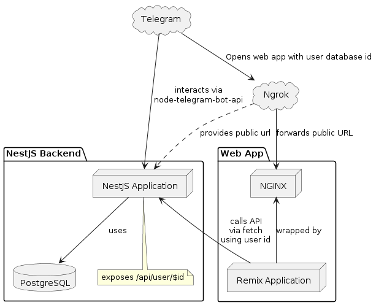

# TL;DR
```shell
# Install docker and yarn
yarn dev:mock_config
# Edit .env file to set your telegram bot token and ngrok authtoken
yarn start
# Play with the bot ...
yarn cleanup
# You are great!
```
# Telegram bot

Simple Telegram bot that sends a message to the user when the admin sends a message to the bot.

This project is only demonstration purposes.

It is mono-repo project that contains the following packages:
- `backend` - NestJS application that listens for incoming messages from the Telegram bot.
- `frontend` - Remix application that sends a message to the user when the admin sends a message to the bot.

## Supported telegram commands
- `/start` - Start the chat with the bot.
- `/adminhello <telegramUserId> <message>` - Send message to user. For admins only

### Additional Features
DEV MODE ONLY
- `/set_me_admin` - Changes your role to admin.
- `/set_me_user` - Changes your role to user.
- `/getusers` - Returns list of users. Be careful with this command, there is no pagination. For admins only

Those commands are available only in development mode.
To change it, you need to change the `DEV_MODE` environment variable to `false` in the `.env` file.
It exists only because I'm too lazy to use pg client).

Also, it sends Warning Bot service init and falls if `DEV_MODE=true && NODE_ENV='production'` just to avoid dramatic issues.
That code MUST be removed in production.

### Application Schema:


## Prerequisites

Before you begin, ensure you have met the following requirements:

- You have installed the latest version of [Docker](https://www.docker.com/products/docker-desktop).
- You have a [Telegram](https://telegram.org/) account and have created a bot.
- You have a [ngrok](https://ngrok.com) account to have public url for local development. [Auth Token Page](https://dashboard.ngrok.com/get-started/your-authtoken)


## Running the Project

To run this project, follow these steps:

## Set the environment variables in the `.env` file.
    
```sh
yarn dev:mock_config
```
You can also change the environment variables in the `.env` file.
Check the `.env.example` file for the environment variables.

## Start standalone local project
```shell
yarn start
```
This will start the project in standalone mode.
It uses docker-compose to start the project.

## Using Telegram Bot

To use the Telegram bot, follow these steps:

1. Open the Telegram app.
2. Search for your bot (as named when you created it).
3. Start a chat with the bot.


# How It Works

The project has two main parts:
## Backend 
Stack:
- NestJS
- Prisma
- PostgreSQL


- The backend is a NestJS application that listens for incoming messages from the Telegram bot.
- The backend sends a message to the user when the admin sends a message to the bot.
- The backend store the chat id of the user in the database.

## Frontend
Stack:
- Remix
- TailwindCSS
- shadcn/ui

## More
- nginx: Frontend wrapped nginx server that serves the frontend application.
- ngrok: Public url for local development.

## How to develop
You can develop the frontend and backend separately.
Check the `frontend` and `backend` packages readme for more information.

# Why's
- Remix & TailwindCSS & shadcn/ui: I think it's a most effective stack to develop frontend MVC project.
- NestJS & PostgreSQL: Scalable, fast, and easy to develop backend application. Also, it's a good choice for the microservice architecture.
- Ngrok: Public url for local development. It's a good choice for the development of the Telegram bot, because you need to have public https to run your web apps.
- Nginx: It's a good choice to serve the frontend application. It's fast and easy to configure. In the future, you can add more configurations to the nginx server to serve the frontend application.
- Mono-repo: It's a good choice to develop the project in a single repository. It's easy to manage the project and share the code between the packages.
- yarn: Hipster style package manager, absolutely no arguments here.

## Things to do
- Typing safety API between nest and remix. It might be graphql or tRPC.
- Use telegram css vars for the frontend.
- Maybe move database storage to another package if it will be used in other packages.
- Add some CI linting and testing.


## Remove artefacts

If you want to remove the artefacts, follow these steps:

```shell
yarn cleanup
```

## Contact
https://t.me/ArtemAlexandrov
